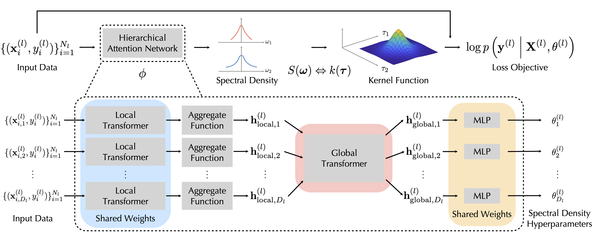

# Task-Agnostic Amortized Inference of Gaussian Process Hyperparameters (AHGP)



This repository contains code and pretrained-models for the task-agnostic amortized inference of GP hyperparameters (AHGP) proposed in our [NeurIPS 2020 paper](https://papers.nips.cc/paper/2020/hash/f52db9f7c0ae7017ee41f63c2a7353bc-Abstract.html). AHGP is a method that allows light-weight amortized inference of GP hyperparameters through a pre-trained neural model.

The repository also includes a pip installable package that includes the essential components for using AHGP for GP hyperparameters inference. The hope is to make it easier for you to use AHGP with a simple function call.

If you find this repository helpful, please cite our NeurIPS 2020 paper:
```
@incollection{liu2020ahgp,
  title={Task-Agnostic Amortized Inference of Gaussian Process Hyperparameters},
  author={Liu, Sulin and Sun, Xingyuan and Ramadge, Peter J. and Adams, Ryan P.},
  booktitle={Advances in Neural Information Processing Systems},
  year={2020}
}
```


## Package installation and usage

### Installation

The essential components of AHGP are packaged in `model/` and you can install this via PyPI:
```bash
pip install amor-hyp-gp
```

### Requirement

`amor-hyp-gp` has the following dependencies:
* `python >= 3.6`
* `pytorch >= 1.3.0`
* `tensorboardX`
* `easydict`
* `PyYAML`

### Usage

Usage examples are included in `examples/`. `example_ahgp_inference.py` contains an example of full GP inference, which uses amortized GP hyperparameter inference and full GP prediction implemented in `PyTorch`. 
`example_ahgp_hyperparameters.py` contains an example that outputs the GP hyperprameters (means and variances of the Gaussian mixtures for modeling the spectral density).

`config/model.yaml` provides a example configuration file of the pretrained model to be used for amortized inference. 

## Code for training and running the models

### Generating synthetic data for training
An example of generating synthetic training data from GP priors with stationary kernels is provided in `get_data_gp.py`.

### Running experiments described in the AHGP paper
To run the experiments, you will need the following extra dependencies:
* `GPy`
* `emukit`

The UCI regression benchmark datasets are stored in `data/regression_datasets`. The Bayesian optimization functions are implemented in `utils/bo_function.py`. The Bayesian quadrature functions are imported from the `emukit` package.

**Training model**

To train a neural model for amortized inference, you can run:
```bash
python run_exp.py -c config/train.yaml
```
In `config/train.yaml`, you can define the configurations for the neural model and training hyperparameters. 

**Regression experiments**

To run the experiments on regression benchmarks with the pretrained neural model, run:
```bash
python run_exp.py -c config/regression.yaml -t
```
In `config/regression.yaml`, you can define the configurations of the pretrained model and the regression experiment.

**Bayesian optimization experiments**

To run the Bayesian optimization experiments with the pretrained neural model, run:
```bash
python run_exp_bo.py -c config/bo.yaml
```
In `config/bo.yaml`, you can define the configurations of the pretrained model and the BO experiment.

**Bayesian quadrature experiments**

To run the Bayesian quadrature experiments with the pretrained neural model, run:
```bash
python run_exp_bq.py -c config/bq.yaml
```
In `config/bq.yaml`, you can define the configurations of the pretrained model and the BQ experiment.

## Authors:
* [Sulin Liu](https://liusulin.github.io/)
* [Xingyuan Sun](http://people.csail.mit.edu/xingyuan/)
* [Peter J. Ramadge](https://ee.princeton.edu/people/peter-j-ramadge)
* [Ryan P. Adams](https://www.cs.princeton.edu/~rpa/)

Please reach out to us with any questions! 